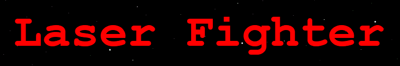

# Laser-Fighter

Laser Fighter is a 2D laser shooting game and is the first game that I have created. The first versions was finished in December of 2021 and it has been growing ever since. About 500 hours of work have so far been put into this game and more is along the way. I created this game not only because it was fun but also because I wanted to learn more about the software development process by actually creating a real piece of software. Considering I am really familiter with gaming and indie games, I felt that a 2D pixel shooting game would be a good place to start.

## Version 0.3.0a:

This branch contains the source code for Laser Fighter v0.3.0a. This version was completed in January of 2023. This was a small update that I made over winter break. This version of the game fixed a lot of the bugs that were introduced in version 0.2.0a, and it is more stable than verions 0.0.1a and version 0.2.0a. The code in this version however is still extremely messy and all in one file. Since I only had two weeks to make this update, I focused more on fixing bugs rather than optimizing code. This means that the lag in this version of the game is not much better than the previous version.

NOTE: The exe file for this application is unsigned and has an unverified publisher. This means that windows defender and other antiviruses may be suspicious of the file. If this happens, simply select "Run Anyway". Make sure you are downloading Laser Figher from the [Laser Fighter GitHub](https://github.com/Christian2147/Laser-Fighter) and no other external source. If you download Laser Fighter from any other source, I am not responsible for any damage that the executable may cause. Outside of this GitHub page, anyone is allowed to make whatever modifications they want to this software.

## Changelog:

### Additions
+ Added a statistics screen, where you can see a list of your in-game stats

### Changes
* Fixed the flickering text bug
* Fixed a bug that sometimes caused buttons to not register a click from the mouse
* Fixed a bug that caused the text of certain buttons to turn yellow while changing modes even if not hovering over them
* Changed the window icon to the offical Laser Fighter icon
* Changed the color of all buttons to be darker so that the text is easier to read

## License

Copyright (c) [2024] [Christian Marinkovich]

This project is licensed under the GNU General Public License v3.0. See the [LICENSE](./LICENSE) file for details.

