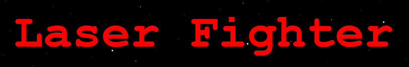

# Laser-Fighter

Laser Fighter is a 2D laser shooting game and is the first game that I have created. The first version was finished in December of 2021 and it has been growing ever since. About 600 hours of work have so far been put into this game and more is on the way. I created this game not only because it was fun but also because I wanted to learn more about the software development process by actually creating a real piece of software. Considering I am really familiar with gaming and indie games, I felt that a 2D pixel shooting game would be a good place to start. If you want to know more about the history of Laser Fighter and how it came to be, be sure to check out its [history](./docs/HISTORY.md).

## HOTFIX 1.2.2b:

This branch contains the source code for Laser Fighter v1.2.2b. This version was completed in August of 2025. This update is a major HOTFIX update released in order to fix major performance issues in previous versions and convert the codebase from using turtle as the main library to using pygame as the main library. This updates sets the foundation for major updates in the future, as now that the game is running on a much more powerful engine, there are endless possibilities. 

NOTE: The exe file for this application is unsigned and has an unverified publisher. This means that Windows Defender and other antivirus software may be suspicious of the file. If this happens, simply select "Run Anyway". Make sure you are downloading Laser Fighter from the [Laser Fighter GitHub](https://github.com/Christian2147/Laser-Fighter) and no other external source. If you download Laser Fighter from any other source, I am not responsible for any damage that the executable may cause. Outside of this GitHub page, anyone is allowed to make whatever modifications they want to this software.

## Changelog:

### Additions
* Added in-game pop-ups, which have replaced the default operating system pop-ups
* Added support for dozens of new key bindings for controls, including mouse buttons and special keys

### Changes
* Changed the games codebase from using turtle as the main library to using pygame as the main library
* Major performance improvements, especially noticeable when the game runs for a really long time
* Converted all textures from GIF to PNG
* Fixed issue regarding "_Scaled" textures. Now, all textures are automatically scaled in-game, without being saved to disk
* Fixed a bug that caused a white border to appear around the screen in fullscreen mode
* Fixed a bug that caused the armor bar to appear when god mode was enabled
* Changed the keybinding control setting process to be more user friendly
* Made game controls and player movement a lot smoother than before

## Helpful Links

For a full list of specifications and requirements, go to the [specifications page](./docs/SPECIFICATIONS.md) 
For instructions on how to install the game or use the source code, go to the [instructions page](./docs/INSTRUCTIONS.md) 
For a brief overview of the games features and storyline, go to the [features page](./docs/FEATURES.md) 

## License

Copyright (c) [2025] [Christian Marinkovich]

This project is licensed under the GNU General Public License v3.0. See the [LICENSE](./LICENSE) file for details.

