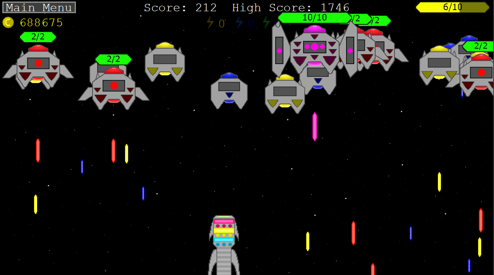
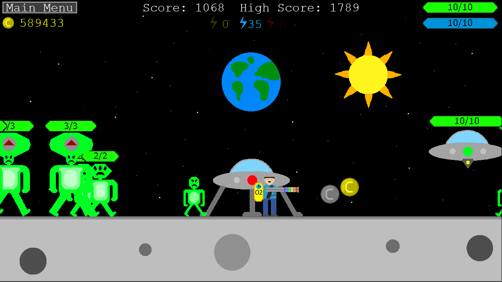
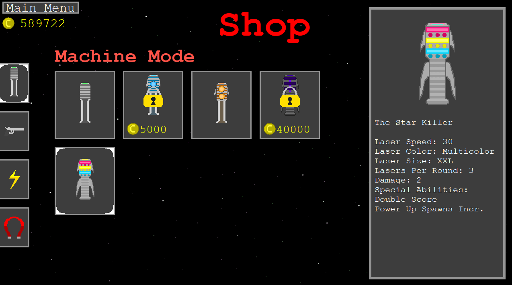
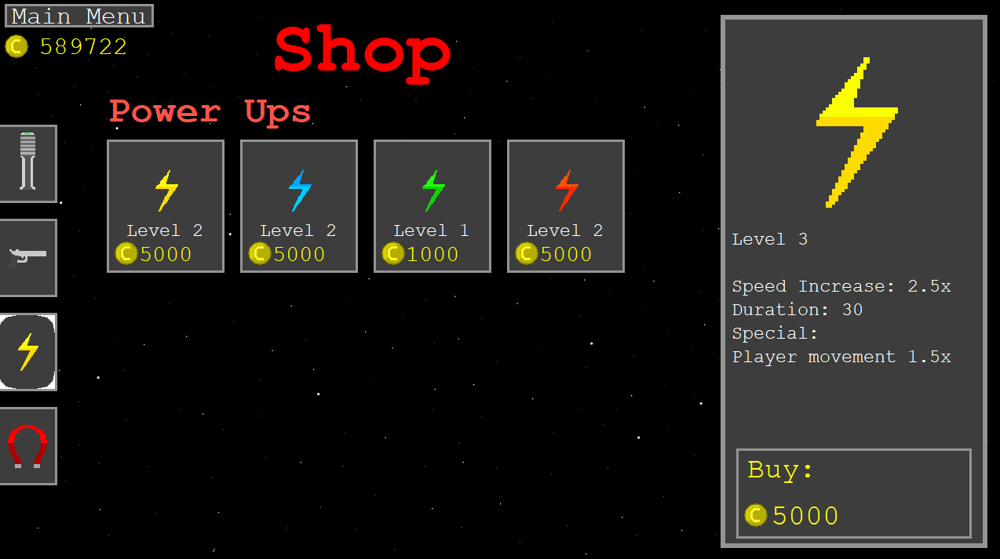
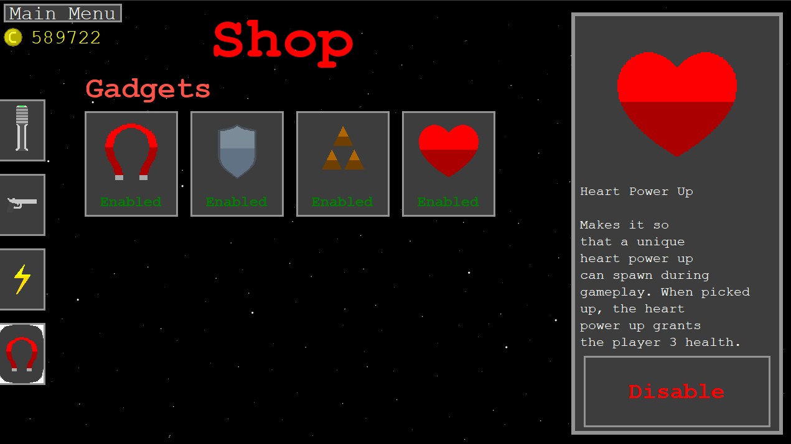

# Everything Laser Fighter Offers

Laser Fighter is a 2D laser shooting game that is set in outer space. It offers two gameplay modes: Machine Mode and Alien Mode. It also offers a small storyline and several aspects of game progression. Below, I will go over all of this in greater detail.

## Machine Mode:

Machine Mode is the first gameplay mode that you will encounter in Laser Fighter. In Machine Mode, you are set in outer space and trying to kill as many enemy machines as possible. The enemy machines look down at the player and shoot lasers at the player. The enemy machines come in the following types:

**Blue Machine**: The smallest of the enemy machines and the easiest to kill. Grants one point upon death.

**Yellow Machine**: The second machine that you encounter. Has a faster moving laser and is bigger than the blue machine. Grants two points upon death.

**Red Machine**: The third machine that you will encounter. Has a bigger and faster moving laser, more health, and is bigger than the yellow machine.

**Pink Machine Boss**: The final machine enemy that you will encounter in Machine Mode. Only one of these will spawn at any given moment. They are big, have 10 health, and have a very fast moving laser. The laser moves faster the lower its health gets. The Pink Machine Boss only spawns after all the blue, yellow, and red machines have all spawned.

You, the player, are a laser machine that is hanging off of a ship (Which is imagined to be below the screen behind the laser machine and invisible to the user)

## Alien Mode:

Alien Mode is the second gameplay mode that you will encounter in Laser Fighter. In Alien Mode, you are on the moon and trying to kill as many aliens as possible. The aliens will spawn off the edges of the screen and start moving towards the player, trying to kill the player. the more aliens that the player kills, the faster they move. The aliens come in the following types:

**Small Alien**: The same height as the player and has only 1 health.

**Medium Alien**: Slightly taller than the player and has 2 health.

**Large Alien**: Much taller than the player and has 3 health.

**Alien Saucer**: Spawn floating in the air and shoots lasers down at the player. The player must jump to hit it. The Alien UFO has 10 health. The Alien UFO only spawns after all the small, medium, and large aliens have spawned in.

You, the player, spawn in the center of the map with a gun and an oxygen tank as a human astronaut. Your goal is to defend yourself from all the incoming aliens.

## The Storyline:

What connects Machine Mode, Alien Mode, and the game as a whole is the storyline. The storyline is very casual, but provides a plot for the game. The story lines goes as follows:

You are in a time period at some point in the far future. Mysterious aliens, which appear to be a type 2 civilization, have taken over the region around Earth. You have been assigned the task of saving humanity from these cruel creatures and to get rid of them, once and for all. You are going into this mission with a few pieces of key knowledge:

1. The aliens central base is located on the moon
2. Without their central base, they would not be able to operate in this region, and therefore will be forced to leave
3. They are everywhere, and running into them has a high chance of being deadly. That being said, survival is not a guarantee!

You have decided to accept the mission. The first part of the mission is Machine Mode, which takes place on your trip to the moon. The aliens detect you on their radars trying to fly towards the moon and immediately start swarming you, trying to kill you. Your goal in this mode is to make it to the moon and successfully land. Landing should be the easy part, as the aliens will not attack with such aggressive levels of fire while you are that close to their central base. 

When you finally enter and land safely on the moon, you enter Alien Mode. In Alien Mode, your goal is to kill an alien saucer so that you can get a key and a map to their central base. Here, the aliens will also start swarming you just like before, as there are tons of them all over the moon. However, it is easier to kill them here as they do not have as powerful of weapons. 

When you finally kill an alien saucer, you are ready to find and enter their central base of operations. 

After entering their base, you goal is to destroy it and discover the secrets as to why the aliens chose the moon out of all places to settle on. This will be completed in a future mode of the game that is not out yet. :)

## The Game Progression:

You must progress through the modes in order. Beating the boss in Machine Mode unlocks Alien Mode, and beating the boss in Alien Mode will unlock a third mode in the future.

Outside of the required milestones, there are many ways to upgrade your character.

### 1. Upgrade your weapon:

In both Machine Mode, you can upgrade your weapons to 4 different types through the shop. These will cost you a certain amount of coins which you can earn while playing the game.

### 2. Upgrade your power ups:

In the shop, you can also upgrade your power ups with the use of coins. This will make your character even more powerful and make the gameplay more unique.

### 3. Equip Gadgets:

In the shop, you can also buy and equip player gadgets. These will give the player special abilities, like armor and thorns, which will enhance the gameplay.

All of these features are intended to allow the user to make their character more and more powerful. This creates a unique gameplay experience.

## Note:

This is only a brief overview of the games features. A more detailed overview of the games features will be available on the Laser Fighter Wiki, which is planned to come out at some point in January of 2025.

## License

Copyright (c) [2024] [Christian Marinkovich]

This project is licensed under the GNU General Public License v3.0. See the [LICENSE](./LICENSE) file for details.

